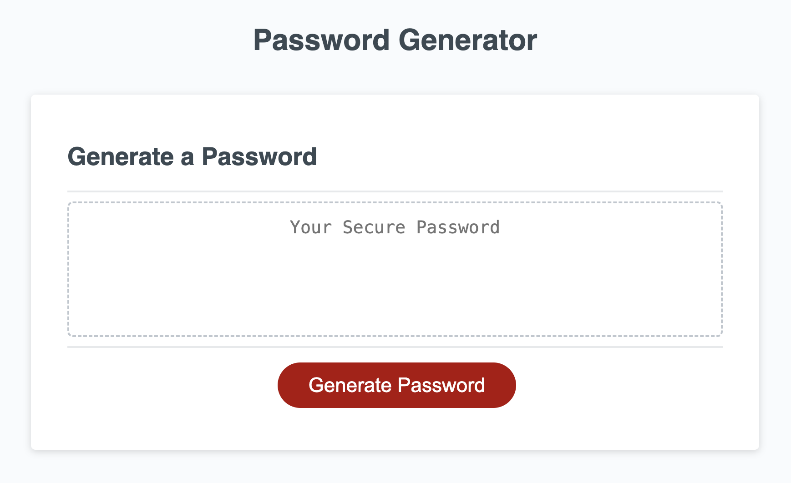

# Password Generator
edX Module 5 Challenge

## Description
This is the module 5 challenge of the edX web developer bootcamp in which I have created a random password generator using javaScript.

## Installation
N/A

## Usage
Click generate password and enter your choices when prompted to create a unique password.

## Credits
The starter code for this challenge was provided by edX web development bootcamp.

## License
Please refer to the LICENSE in the repo-